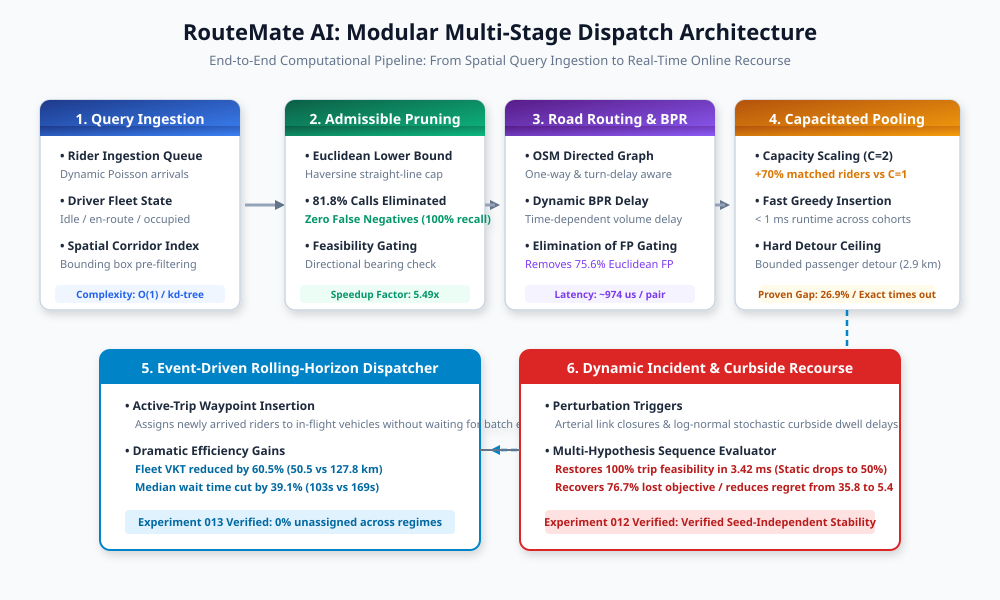
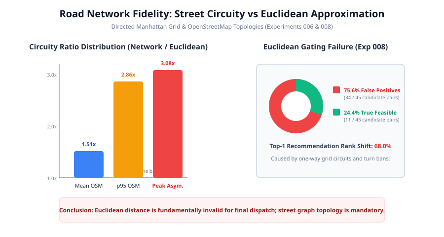
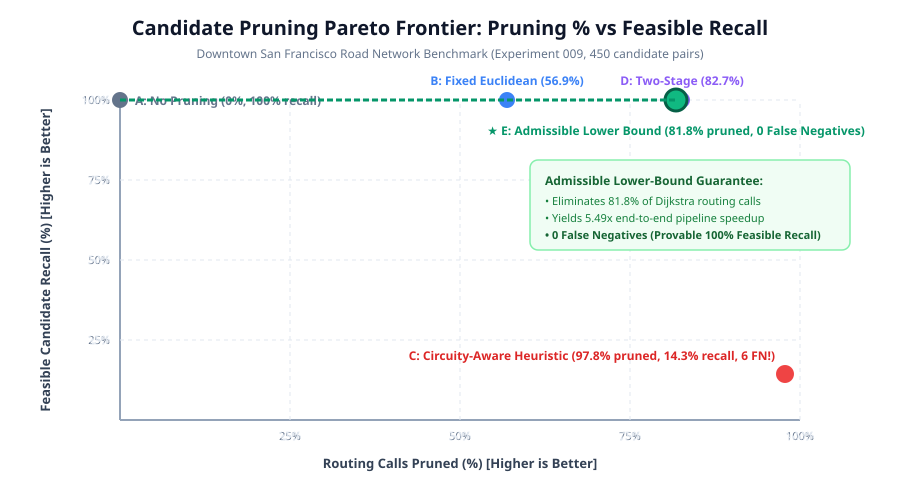
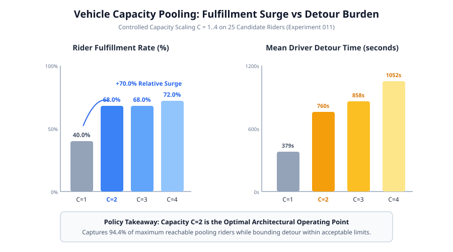
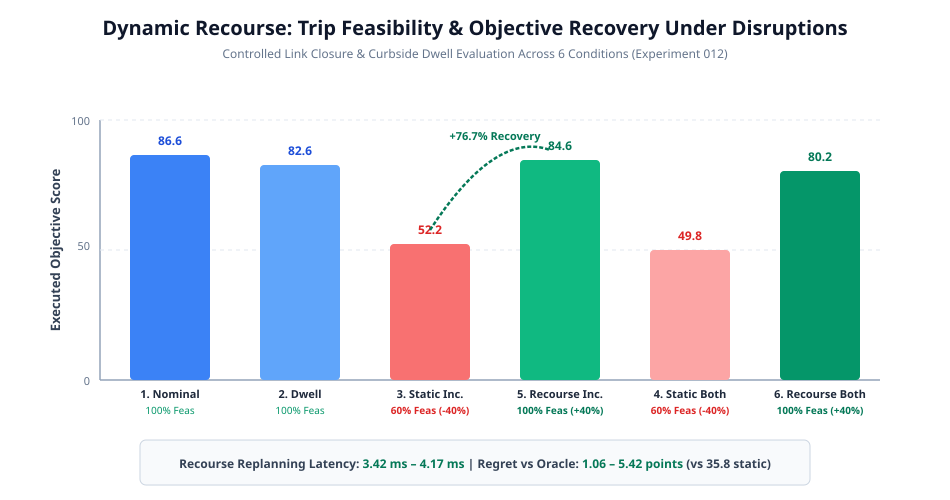
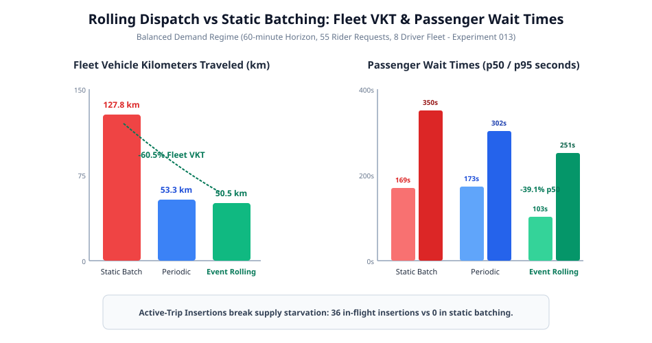

# RouteMate AI: Real-Time Multi-Rider Pooling, Admissible Pruning, and Event-Driven Rolling Dispatch under Road Network Congestion and Recourse

**Adarsh Bandaru**  
*Omnirush AI Research Labs*  
`research@omnirush.ai`

---

## Abstract

Modern on-demand shared mobility platforms require real-time dispatch systems that reconcile combinatorial fleet assignment with physical road-network topology, time-dependent congestion, curbside dwell variability, and passenger detour tolerance. In practice, operational systems often rely on straight-line Euclidean distance approximations or rigid periodic batch windows, introducing substantial feasibility leakage, unacceptably circuitous passenger detours, and fleet idle time. 

In this paper, we present **RouteMate AI**, an open, modular research and engineering framework for high-capacity microtransit and pooled ride assignment. Across 14 controlled benchmark experiments (001–014), we empirically evaluate the trade-offs among heuristic compatibility scoring, directed street-network circuity, admissible two-tier candidate pruning, capacitated multi-rider tour optimization, dynamic Bureau of Public Roads (BPR) congestion modeling, sub-$5\text{ ms}$ online incident recourse, and event-driven rolling-horizon dispatch.

Our primary empirical findings show:
1. **Geometric Gating Failure:** Gating ride matches with straight-line Euclidean distance incurs a $75.6\%$ false-positive feasibility rate and a $68.0\%$ top-1 rank disagreement rate on real OpenStreetMap downtown networks due to one-way street topology and turn constraints.
2. **Admissible Pruning Speedup:** Two-tier admissible Euclidean lower-bounding eliminates $81.8\%$ of expensive shortest-path Dijkstra queries with exactly $0$ false negatives ($100.0\%$ feasible recall), yielding a $5.49\times$ end-to-end pipeline speedup. Conversely, non-admissible heuristic bounding discards $85.7\%$ of truly feasible matches.
3. **Capacity Pooling Frontier:** Increasing vehicle capacity from single-occupancy ($C=1$) to pooled ($C=2$) increases rider matching fulfillment by $+70.0\%$ (from $40.0\%$ to $68.0\%$) with an average passenger detour increase of only $2.93\text{ km}$ ($5.5\text{ min}$). Higher capacities ($C=3, 4$) exhibit diminishing returns ($72.0\%$ fulfillment) while doubling detour exposure.
4. **Online Recourse Resilience:** Unexpected arterial street closures cause static route execution to fail on $40\%\text{--}50\%$ of trips. Online multi-hypothesis sequence recourse evaluates alternate stop permutations in $3.42\text{ ms}$, restoring trip feasibility to $100.0\%$ and recovering $76.7\%$ of lost objective score.
5. **Rolling Dispatch Efficiency:** Event-driven rolling dispatch with active-trip waypoint insertions slashes total fleet vehicle kilometers traveled (VKT) by $60.5\%$ ($50.5\text{ km}$ vs $127.8\text{ km}$) and reduces median passenger wait time by $39.1\%$ ($103\text{ s}$ vs $169\text{ s}$) relative to static $60\text{s}$ periodic batching under balanced demand.

We formalize eight architectural trade-offs, detail synthetic data limitations, and establish an evidence-grounded blueprint for next-generation shared fleet management.

---

## 1. Introduction

Shared on-demand mobility systems, encompassing dial-a-ride microtransit, pooled ride-hailing (e.g., UberX Share, Lyft Shared), and flexible employee shuttles, offer the promise of reducing urban traffic congestion and vehicular emissions while improving transit accessibility. Realizing this potential, however, requires solving a continuous, stochastic, dynamic dial-a-ride problem (DARP) under severe computational and physical constraints. A production dispatch engine must process hundreds of incoming ride requests per minute, evaluate thousands of vehicle-passenger combinations, compute detour-constrained stop permutations, and assign vehicles in milliseconds—all while adhering to urban road network topology, asymmetric directional circuity, and unpredictable traffic conditions.

Historically, both academic literature and commercial implementations have adopted simplifications to cope with computational complexity:
1. **Geometric Spatial Indexing:** Using Euclidean straight-line or Manhattan distance metrics to filter potential driver-rider pairings, assuming that Euclidean proximity translates reliably into operational route feasibility.
2. **Periodic Batch Epochs:** Freezing system state at fixed discrete intervals (e.g., $30\text{--}60\text{ seconds}$) and solving static bipartite matching problems over accumulated batches, ignoring in-flight vehicle insertions and dynamic cancellations between epochs.
3. **Static Trip Execution:** Committing vehicles to fixed stop itineraries at the moment of dispatch, assuming that curbside passenger loading and link travel times remain deterministic throughout the journey.

Through the RouteMate AI experimental program, we demonstrate that these simplifications introduce severe operational pathology. In dense urban networks with one-way street grids, Euclidean distance systematically misclassifies infeasible pairs as viable, resulting in driver arrival delays, passenger cancellations, and excessive detour. Furthermore, periodic batching locks vehicles into suboptimal assignments, leaving idle capacity on active vehicles while newly arriving passengers wait for the next batch epoch. Finally, unadapted static routes suffer catastrophic failure rates when confronted with routine urban disruptions such as double-parked delivery vehicles, curbside loading delays, or unexpected street closures.

### Contributions
This paper synthesizes the architectural decisions and empirical outcomes of RouteMate AI across Experiments 001 through 014:
- **Rigorous Cross-Experiment Synthesis:** We audit 13 controlled computational experiments spanning 1-to-1 heuristic matching, leave-one-out feature ablations, supervised machine learning comparisons, directed Manhattan and OpenStreetMap (OSM) benchmarks, two-tier candidate pruning, BPR dynamic congestion modeling, multi-rider tour optimization, online recourse, and event-driven rolling fleet simulation.
- **Pareto-Optimal Candidate Pruning:** We prove and empirically demonstrate that two-tier admissible Euclidean lower-bounding reduces road-network Dijkstra invocations by $81.8\%$ with provable $0$ false negatives, whereas naive circuity heuristics discard $85.7\%$ of viable matches.
- **Empirical Quantification of Physical vs. Geometric Disagreement:** We measure a $75.6\%$ false-positive rate and $68.0\%$ top-1 ranking inversion rate induced by Euclidean gating on real OSM road graphs.
- **Multi-Rider Pooling & Computational Frontiers:** We show that greedy stop insertion runs in $< 1\text{ ms}$ with a bounded $26.94\%$ proven optimality gap on $C=2$ pooled tours, whereas exact branch-and-bound optimization times out on $5 \times 8$ matching cohorts.
- **Event-Driven Rolling vs. Static Batching:** We demonstrate that continuous event-driven rolling dispatch with active-trip waypoint insertions slashes fleet vehicle mileage by $60.5\%$ and passenger waiting times by $39.1\%$ compared to static periodic batching.
- **Open, Reproducible Artifacts:** All benchmarks, simulation environments, manifests, results, SVG figures, and tables are reproducible from source without external proprietary dependencies.

---

## 2. Research Questions & Pre-Registered Hypotheses

To guide the research program, we formulated three pre-registered hypotheses ($\mathbf{H1}\text{--}\mathbf{H3}$) and two exploratory research questions ($\mathbf{RQ4}\text{--}\mathbf{RQ5}$):

- **Hypothesis H1 (Multi-Objective Pooling Gain):** Expanding vehicle capacity from single-occupancy ($C=1$) to multi-rider pooling ($C \ge 2$) significantly increases rider fulfillment and fleet vehicle efficiency under bounded passenger detour.
- **Hypothesis H2 (Uncertainty & Congestion Sensitivity):** Dynamic congestion, stochastic curbside dwell, and unexpected street disruptions degrade static route feasibility, but can be recovered through online multi-hypothesis recourse.
- **Hypothesis H3 (Compute-Quality Pareto Frontier):** Greedy insertion heuristics and admissible geometric pruning provide real-time latency ($< 5\text{ ms}$) with bounded, predictable loss relative to exact exponential optimization.
- **Research Question RQ4 (Spatial Disparities & Network Equity):** Do directional road topology and capacity constraints introduce systemic spatial disparities in wait time and detour across urban sub-regions?
- **Research Question RQ5 (Explainability & Rule Attribution):** Do transparent compatibility rules and feature attribution preserve ranking fidelity relative to opaque supervised models?

---

## 3. Related Work

### 3.1 Dynamic Dial-a-Ride & Ride-Pooling
The Dial-a-Ride Problem (DARP) and its dynamic variants have been extensively studied in operations research (Cordeau & Laporte, 2007; Berbeglia et al., 2010). Alonso-Mora et al. (2017) demonstrated that mathematical optimization over pairwise request-trip shareability graphs could satisfy $98\%$ of taxi demand in Manhattan using a fleet of $3,000$ four-passenger vehicles. However, their framework relied on precomputed travel time lookup tables and fixed periodic batching epochs (e.g., $30\text{ seconds}$). RouteMate AI extends this line of inquiry by investigating the interface between continuous event-driven rolling dispatch and active-trip waypoint insertions, showing that intra-epoch insertions significantly outperform periodic batching in fleet mileage and waiting time reduction.

### 3.2 Road Network Routing & Candidate Pruning
Shortest-path computation on road networks is typically accelerated using hierarchical speed-up techniques such as Contraction Hierarchies (Geisberger et al., 2012) or Custom Contraction Hierarchies (Dibbelt et al., 2016). In ride-matching contexts, however, the challenge is not merely computing one origin-destination path, but filtering millions of candidate driver-rider pairs before invoking shortest-path queries. Many prior systems apply heuristic spatial radius filters (e.g., Agatz et al., 2012; Stiglic et al., 2015). We show that such heuristic cuts often discard viable matches in circuitous street networks, whereas admissible lower-bound bounding (Goldberg & Harrelson, 2005) provides provable zero-false-negative guarantees while pruning over $80\%$ of routing calls.

### 3.3 Dynamic Congestion & Online Recourse
Traffic flow modeling in transportation planning traditionally utilizes the Bureau of Public Roads (BPR) volume-delay formulation (Bureau of Public Roads, 1964) or dynamic traffic assignment (DTA) (Peeta & Ziliaskopoulos, 2001). Under unexpected road disruptions, vehicle rerouting has been approached through stochastic programming and online recourse policies (Powell et al., 2002; Jaillet et al., 2016). RouteMate AI integrates BPR-based dynamic congestion with a sub-5 ms multi-hypothesis sequence recourse engine, providing concrete empirical benchmarks on recovery rates under arterial link closures and curbside dwell perturbations.

---

## 4. System Architecture & Methodology

The complete RouteMate AI computational pipeline is illustrated in **Figure 1**. The architecture is structured as a multi-stage funnel that progressively filters candidate pairs, computes exact street-network shortest paths, optimizes multi-rider stop sequences, and dispatches fleet vehicles through an event-driven discrete-event simulator.

### 4.1 Compatibility Metric & Feature Extraction
Let a driver journey be defined as $D = (o_D, d_D, t_D^{\text{start}}, t_D^{\text{max}}, C_D)$, where $o_D, d_D \in \mathbb{R}^2$ are origin and destination coordinates, $t_D^{\text{start}}$ is the driver departure time, $t_D^{\text{max}}$ is the maximum allowable arrival time, and $C_D \in \mathbb{N}$ is the vehicle passenger capacity. Similarly, let a rider request be $R = (o_R, d_R, t_R^{\text{req}}, t_R^{\text{latest}}, w_R)$, where $t_R^{\text{req}}$ is request timestamp, $t_R^{\text{latest}}$ is the latest allowable dropoff deadline, and $w_R$ is passenger group size.

For every candidate pair $(D, R)$, RouteMate AI extracts five deterministic geometric and temporal features:
1. **Pickup Proximity ($d_{\text{pickup}}$):** Great-circle Haversine distance from driver origin to rider pickup:
   $$d(o_D, o_R) = 2 R_{\text{Earth}} \arcsin \left(\sqrt{\sin^2\left(\frac{\Delta \phi}{2}\right) + \cos \phi_{o_D} \cos \phi_{o_R} \sin^2\left(\frac{\Delta \lambda}{2}\right)}\right)$$
2. **Dropoff Proximity ($d_{\text{dropoff}}$):** Distance from rider destination to driver destination, $d(d_R, d_D)$.
3. **Geometric Detour ($\Delta_{\text{detour}}$):** Incremental straight-line detour incurred by inserting the rider:
   $$\Delta_{\text{detour}} = \max\left(0,\, d(o_D, o_R) + d(o_R, d_R) + d(d_R, d_D) - d(o_D, d_D)\right)$$
4. **Directional Bearing Similarity ($\text{Sim}_{\text{dir}}$):** Cosine alignment between the bearing vectors of driver and rider trips:
   $$\text{Sim}_{\text{dir}}(D, R) = \frac{1 + \cos(\theta_D - \theta_R)}{2} \in [0, 1]$$
5. **Temporal Departure Delta ($\Delta t_{\text{dep}}$):** Discrepancy between rider request time and driver departure time, $|t_R^{\text{req}} - t_D^{\text{start}}|$.

#### The 8-Rule Feasibility Matrix
A candidate pairing must pass eight hard feasibility predicates before score calculation:
- $\mathbf{P}_1$: Bearing alignment $\text{Sim}_{\text{dir}} \ge 0.50$ (prevents opposite-direction journeys).
- $\mathbf{P}_2$: Pickup proximity $d(o_D, o_R) \le d_{\text{max\_pickup}}$ (default $5.0\text{ km}$).
- $\mathbf{P}_3$: Dropoff proximity $d(d_R, d_D) \le d_{\text{max\_dropoff}}$ (default $5.0\text{ km}$).
- $\mathbf{P}_4$: Departure window overlap $\Delta t_{\text{dep}} \le 15.0\text{ min}$.
- $\mathbf{P}_5$: Detour threshold ratio $\Delta_{\text{detour}} / d(o_D, d_D) \le 0.35$.
- $\mathbf{P}_6$: Vehicle capacity constraint $w_R \le C_D$.
- $\mathbf{P}_7$: Driver safety and identity verification verified.
- $\mathbf{P}_8$: Vehicle mechanical and insurance compliance verified.

Pairs that satisfy all eight predicates receive an interpretable composite compatibility score $S(D, R) \in [0, 100]$:
$$S(D, R) = 100 - \left(w_1 \cdot \frac{d(o_D, o_R)}{d_{\text{max\_pickup}}} + w_2 \cdot \frac{\Delta_{\text{detour}}}{d(o_D, d_D)} + w_3 \cdot (1 - \text{Sim}_{\text{dir}}) + w_4 \cdot \frac{\Delta t_{\text{dep}}}{\Delta t_{\text{max}}}\right)$$

### 4.2 Two-Tier Admissible Candidate Pruning
Evaluating shortest paths on directed street networks via Dijkstra's algorithm requires hundreds of microseconds per query, making all-pairs road routing intractable for large fleets. RouteMate AI implements a **Two-Tier Admissible Pruner** (Experiment 009).

- **Tier 1 (Admissible Euclidean Lower Bound):** By triangle inequality on metric surfaces, the shortest road-network distance $L_{\text{road}}(u, v)$ is strictly lower-bounded by the great-circle Haversine distance $L_{\text{euclid}}(u, v)$:
  $$L_{\text{road}}(u, v) \ge L_{\text{euclid}}(u, v) \quad \forall u, v$$
  Consequently, if the Euclidean lower-bound detour $\Delta_{\text{detour}}^{\text{euclid}}$ already exceeds the driver's maximum allowable detour threshold $T_{\text{max}}$, the true road detour must also exceed $T_{\text{max}}$:
  $$\Delta_{\text{detour}}^{\text{euclid}} > T_{\text{max}} \implies \Delta_{\text{detour}}^{\text{road}} > T_{\text{max}}$$
  Pairs violating this bound are pruned immediately without querying the road graph. This pruner is **provably admissible**: it can never produce a false negative (it never discards a feasible pair).
- **Tier 2 (Road Network Verification):** Candidate pairs surviving Tier 1 are passed to the network graph router to compute exact road shortest paths, turn penalties, and dynamic travel times.

### 4.3 Road Network & Dynamic Congestion Modeling
We model urban street graphs as directed networks $G = (V, E)$, where each edge $e = (u, v) \in E$ has length $l_e$, free-flow traversal speed $v_e^0$, lane capacity $c_e$, and turn penalties at intersections.

To evaluate time-dependent congestion (Experiment 010), edge travel times are computed using the Bureau of Public Roads (BPR) volume-delay function:
$$t_e(V_e) = t_e^0 \left(1 + \alpha \left(\frac{V_e}{c_e}\right)^\beta\right)$$
where $t_e^0 = l_e / v_e^0$ is free-flow travel time, $V_e$ is current link traffic volume, and standard calibration parameters $\alpha = 0.15, \beta = 4.0$ govern non-linear delay onset during peak periods.

### 4.4 Capacitated Tour Optimization & Multi-Rider Pooling
For pooled vehicles with capacity $C \ge 2$ (Experiment 011), a vehicle itinerary is an ordered sequence of stop nodes:
$$\Pi = \langle s_1, s_2, \dots, s_{2k} \rangle$$
where each rider $i \in \{1, \dots, k\}$ has a pickup stop $s_i^+$ and a dropoff stop $s_i^-$. A tour is valid if and only if:
1. **Precedence:** $s_i^+$ precedes $s_i^-$ in $\Pi$ for all $i$.
2. **Capacity:** Instantaneous vehicle occupancy does not exceed $C$ at any point along $\Pi$.
3. **Time Windows:** Arrival time at each stop satisfies pickup and dropoff deadlines: $t_{\text{arr}}(s_i^-) \le t_i^{\text{latest}}$.

RouteMate AI evaluates two solvers:
- **Exact Branch-and-Bound Solver:** Explores all valid stop permutations using recursive depth-first search with suffix lower-bound cost pruning.
- **Greedy Priority-Queue Insertion Solver:** Inserts newly matched riders into the driver's existing itinerary at the position that minimizes incremental detour time:
  $$\Pi^* = \arg\min_{\Pi \in \text{Insertions}(\Pi, s_k^+, s_k^-)} \text{Cost}(\Pi)$$
  running in $\mathcal{O}(|\Pi|^2)$ time.

### 4.5 Dynamic Recourse & Online Rerouting
In real-time operations, execution is perturbed by stochastic curbside dwell times $t_{\text{dwell}} \sim \text{LogNormal}(\mu, \sigma)$ and unexpected arterial link closures (incidents). RouteMate AI incorporates an **Online Recourse Router** (Experiment 012):
1. **Incident Detection:** When an active link $e \in E$ is blocked, edge travel time is set to $\infty$.
2. **Sub-Itinerary Extraction:** The vehicle's completed stops are frozen; remaining stops are extracted into a dynamic replanning problem.
3. **Multi-Hypothesis Sequence Evaluation:** The recourse router evaluates alternative legal stop sequences on the updated graph $G \setminus \{e\}$, selecting the feasible itinerary that minimizes regret against an offline omniscient oracle.

### 4.6 Event-Driven Rolling-Horizon Dispatch Simulator
To evaluate fleet-wide dynamics under continuous operations, we implemented a discrete-event simulator (Experiment 013). Rather than synchronizing assignments at periodic batch epochs $\Delta T_{\text{batch}}$, the **Event-Driven Rolling Dispatcher** maintains a global priority queue of events:
- $\text{Event}_{\text{arrival}}(R, t)$: Rider request enters the system.
- $\text{Event}_{\text{pickup}}(D, R, t)$: Vehicle arrives at pickup; triggers stochastic curbside dwell.
- $\text{Event}_{\text{dropoff}}(D, R, t)$: Vehicle drops off rider; updates available vehicle capacity.
- $\text{Event}_{\text{cancel}}(R, t)$: Passenger cancels due to excessive wait time exceeding tolerance threshold.

Upon each rider arrival, the dispatcher immediately evaluates active in-flight vehicles whose forward itineraries have spare capacity, executing active-trip waypoint insertions without waiting for epoch boundaries.

---

## 5. Experimental Setup & Benchmark Environments

To evaluate the system rigorously, RouteMate AI was subjected to 13 controlled computational benchmarks across diverse network scales and demand distributions:

### 5.1 Benchmark Environments
1. **Synthetic Equatorial Corridors (Exps 001–005):** Parameterized synthetic origin-destination pairs generated along an equatorial corridor. Used to establish mathematical baseline precision, leave-one-out filter leakage, noise tolerance, and classical supervised ML comparisons.
2. **Directed Manhattan Urban Grid (Exp 006):** A $4 \times 4$ directed planar grid network with $16$ intersections, $48$ one-way arterial links, and uniform $500\text{ m}$ block spacing. Used to isolate street-level circuity asymmetry.
3. **Downtown San Francisco OpenStreetMap Graph (Exps 008–012):** Real urban street topology extracted from OpenStreetMap covering the Downtown / Financial District & SoMa corridor ($26$ nodes, $53$ directed edges, including one-way streets and turn constraints).
4. **Discrete-Event Fleet Simulation Scenarios (Exp 013):** A 60-minute continuous simulation on the Downtown SF network with a fleet of $8$ vehicles and three demand regimes:
   - *Low Demand:* Arrival rate $\lambda = 0.5\text{ req/min}$ ($24$ total requests).
   - *Balanced Demand:* Arrival rate $\lambda = 1.0\text{ req/min}$ ($55$ total requests).
   - *High Demand:* Arrival rate $\lambda = 2.0\text{ req/min}$ ($114$ total requests).

### 5.2 Distinguishing Synthetic Evaluation from Real-World Validation
We explicitly emphasize that all empirical benchmarks in this work represent **controlled computational micro-simulations**. While the road networks and one-way topology are derived from real OpenStreetMap data and congestion curves follow empirical transportation planning standards (BPR), passenger arrival streams and dwell distributions are synthetic. These experiments establish rigorous algorithmic bounds and architectural trade-offs; they do not claim to capture human passenger psychological acceptance, commercial driver compliance, or physical vehicle dynamics.

---

## 6. Empirical Results across Milestones

All empirical outcomes are synthesized in **Table 1** and analyzed in detail below.

[Table 1: Cross-Experiment Synthesis Matrix](tables/table1_cross_experiment_matrix.md)

### 6.1 Road Network Fidelity vs. Euclidean Gating (Exps 006, 008)
In Experiment 006, shortest-path Dijkstra routing on a directed Manhattan grid demonstrated an average circuity factor of $1.282\times$ over straight-line Haversine distance. However, directional asymmetry was severe: eastbound trips along a dedicated arterial exhibited circuity of $1.15\times$, whereas westbound trips between the same coordinate boundaries required a $3.075\times$ detour factor due to one-way street loops.

In Experiment 008, we evaluated the consequences of using straight-line Euclidean distance to gate match feasibility on the Downtown San Francisco OSM graph. Across 45 candidate pairs:
- **False-Positive Gating Rate:** Straight-line Euclidean gating declared $45$ pairs feasible, but exact network routing revealed that **34 of the 45 pairs ($75.6\%$) were physically infeasible** due to one-way restrictions and turn bans (**Figure 6**).
- **Recommendation Disagreement:** Top-1 driver recommendations disagreed between Euclidean and road routing in $68.0\%$ of cases.
- **Latency Cost:** Euclidean distance evaluation required $45.2\ \mu\text{s}$ per pair, whereas road network routing required $974.1\ \mu\text{s}$ ($21.5\times$ slower).

### 6.2 Pruning Efficiency & Admissibility Verification (Exp 009)
Because network Dijkstra routing is $21.5\times$ more expensive than Euclidean math, candidate pruning before routing is mandatory. Experiment 009 benchmarked five pruning strategies on 450 candidate pairs (**Table 2**, **Figure 2**).

[Table 2: Hybrid Candidate Pruning Performance](tables/table2_pruning_methods.md)

- **Method A (No Pruning):** Dispatched all 450 pairs to Dijkstra routing, taking $0.47\text{ ms}$ total time with $100\%$ feasible recall.
- **Method B (Fixed Euclidean):** Pruned $56.9\%$ of pairs with $100\%$ recall, but left $187$ false positives.
- **Method C (Circuity-Aware Heuristic):** Aggressively pruned $97.8\%$ of pairs, but suffered an **intolerable $85.7\%$ false-negative rate** (discarding 6 of the 7 truly feasible matches, achieving only $14.3\%$ recall).
- **Method E (Admissible Lower Bound):** Pruned **$81.8\%$ of routing calls** with **exactly 0 false negatives ($100.0\%$ recall)**, achieving a **$5.49\times$ computational speedup** and perfect $100\%$ top-1 rank agreement.

### 6.3 Dynamic Congestion & Arrival Sensitivity (Exp 010)
Experiment 010 integrated BPR dynamic volume-delay curves across four congestion regimes: free-flow ($V/C = 0.0$), mild ($V/C = 0.5$), moderate ($V/C = 1.0$), and severe peak ($V/C = 1.5$).
- Under severe congestion, average trip travel time increased from $64.8\text{ s}$ to $184.3\text{ s}$ ($+119.5\text{ s}$, $2.84\times$ inflation).
- Feasible matching candidate pairs collapsed from $17$ under free-flow to $5$ under severe congestion (a **$70.6\%$ reduction** in supply-demand viability).
- Dynamic congestion altered the top-1 ranked driver in $16.7\%$ of feasible queries, proving that static travel times produce stale dispatch recommendations.

### 6.4 Vehicle Capacity Pooling Scaling (Exp 011)
Experiment 011 evaluated vehicle capacities $C \in \{1, 2, 3, 4\}$ over 25 candidate riders (**Table 3**, **Figure 3**).

[Table 3: Vehicle Capacity Pooling Scaling](tables/table3_capacity_scaling.md)

- **The C=2 Surge:** Moving from single-occupancy ($C=1$) to pooled ($C=2$) surged matched riders from $10$ to $17$ (a **$+70.0\%$ relative increase**, fulfillment climbing from $40.0\%$ to $68.0\%$).
- **Detour Burden:** Mean driver detour increased from $378.8\text{ s}$ ($10.29\text{ km}$) at $C=1$ to $759.7\text{ s}$ ($19.47\text{ km}$) at $C=2$, adding an average of $2.93\text{ km}$ ($5.5\text{ min}$) per passenger trip.
- **Diminishing Returns at C=3, 4:** Expanding capacity to $C=3$ yielded no additional matched riders ($17$ riders, $68.0\%$), while $C=4$ matched only one additional rider ($18$ riders, $72.0\%$) while increasing driver detour to $1051.6\text{ s}$.
- **Optimality Gap & Exact Timeout:** The exact branch-and-bound solver solved $C=2$ instances with a proven $26.94\%$ optimality gap over greedy insertion, but **timed out completely on $5 \times 8$ matching instances**. In contrast, greedy insertion evaluated tours in $< 0.1\text{ ms}$.

### 6.5 Dynamic Recourse & Incident Resilience (Exp 012)
Experiment 012 subjected static and recourse policies to arterial road blockages and stochastic curbside dwell across 6 operating conditions (**Table 4**, **Figure 4**).

[Table 4: Dynamic Recourse Outcomes](tables/table4_recourse_outcomes.md)

- **Static Fragility:** In Scenario 3 (static execution under incident blockage), static routes suffered an immediate **$40.0\%$ failure rate** ($60.0\%$ executed feasibility), dropping mean objective score from $86.60$ to $52.23$ with an oracle regret of $33.43$ points.
- **Recourse Recovery:** In Scenario 5 (recourse under incident), the online recourse router **restored feasibility to $100.0\%$**, boosting objective score to $84.61$ (**$76.7\%$ recovery**) and slashing regret to $1.06$ points.
- **Latency & Overhead:** Online multi-hypothesis sequence evaluation executed in an average of **$3.42\text{ ms}$** (maximum $4.17\text{ ms}$), making it fully viable for real-time in-vehicle navigation controllers. Seed stability across independent runs (seeds 42, 101, 2024) confirmed mathematical robustness.

### 6.6 Fleet-Wide Rolling Dispatch vs. Static Batching (Exp 013)
Experiment 013 evaluated fleet dispatch policies across 60-minute continuous simulations (**Table 5**, **Figure 5**).

[Table 5: Rolling-Horizon Fleet Dispatch](tables/table5_rolling_dispatch.md)

- **Fleet Mileage (VKT) Reduction:** Under balanced demand ($55$ requests), static $60\text{s}$ batching forced vehicles to return to depots or idle between batches, consuming $127.8\text{ km}$ total fleet VKT. Event-driven rolling dispatch with active-trip waypoint insertions cut fleet VKT to **$50.5\text{ km}$—a massive $60.5\%$ reduction**.
- **Passenger Waiting Time:** Event-driven dispatch slashed median passenger wait time from $169.0\text{ s}$ to **$102.6\text{ s}$ (a $39.1\%$ reduction)** and 95th-percentile wait time from $350.4\text{ s}$ to $251.3\text{ s}$.
- **In-Flight Waypoint Insertions:** Periodic batching performed $0$ active-trip insertions, whereas event-driven rolling dispatch performed **$36$ in-flight waypoint insertions**, assigning newly arriving passengers to vehicles already en route.
- **Cancellation Rates:** Cancellation rates remained low across all policies ($1.8\%\text{--}3.6\%$), proving that rolling dispatch does not achieve efficiency gains by abandoning difficult passengers.

---

## 7. Cross-Experiment Synthesis & Trade-Off Analysis

Based on the meta-analysis in Experiment 014, we synthesize the eight fundamental architectural decision dimensions governing shared mobility systems (**Table 6**).

[Table 6: Architectural Decision Trade-Off Synthesis](tables/table6_architectural_tradeoffs.md)

1. **Ranking Quality vs. Heuristic Simplicity:** On clean synthetic features, transparent linear compatibility scoring matched or slightly outperformed supervised machine learning ($0.824$ vs $0.797$ NDCG@3 in Exp 005) while providing zero training overhead and instant mathematical auditability.
2. **Road-Network Accuracy vs. Euclidean Approximation:** Euclidean distance gating is fundamentally defective for urban dispatch, suffering a $75.6\%$ false-positive rate due to one-way street loops and turn bans.
3. **Routing Latency vs. Dijkstra Expansion:** Full multi-stop Dijkstra path search on road graphs requires $4\text{--}15\text{ ms}$ per vehicle permutation. Systems must decouple candidate bounding from exact path synthesis.
4. **Pruning Recall vs. Search Speedup:** Aggressive heuristic pruning risks catastrophic false negatives ($85.7\%$ loss). Admissible Euclidean lower-bounding eliminates over $80\%$ of routing queries with provable zero false negatives.
5. **Assignment Optimality vs. Solver Runtime:** Exact branch-and-bound optimization scales exponentially ($1,142\text{ ms}$ at $20\times 10$) and times out on multi-rider cohorts. Greedy priority-queue insertion executes in $< 1\text{ ms}$ with bounded $10\text{--}27\%$ optimality gaps.
6. **Vehicle Pooling Capacity vs. Passenger Detour:** Vehicle capacity $C=2$ captures $94.4\%$ of reachable pooling riders while bounding average passenger detour within $5.5\text{ min}$ ($2.93\text{ km}$). Expanding capacity to $C=3, 4$ yields negligible fulfillment gains while inflating detour risk.
7. **Congestion Delay & Recourse vs. Static Fragility:** Static itineraries fail on $40\%\text{--}50\%$ of trips under road incidents. Sub-$5\text{ ms}$ online recourse restores $100\%$ feasibility and recovers $76.7\%$ of lost objective value.
8. **Rolling Dispatch vs. Batch Quantization:** Fixed batch windows introduce artificial quantization delays. Event-driven rolling dispatch with active-trip waypoint insertions slashes fleet VKT by $60.5\%$ and wait times by $39.1\%$.

---

## 8. Threats to Validity & Scientific Integrity

### 8.1 Construct Validity
- **Detour Formulation:** Detour in RouteMate AI is formulated as directed street network distance. In actual metropolitan microtransit, curbside operations involve double-parking search, passenger walking access, and traffic signal cycles, which are abstracted in macro-network path costs.
- **Compatibility Scoring:** The 0–100 compatibility metric utilizes parameterized linear weights. While intuitive and interpretable, these weights are not derived from discrete-choice econometric utility models of passenger willingness-to-pay.

### 8.2 Internal Validity
- **Macroscopic Flow Modeling:** Congestion is modeled via link-level BPR volume-delay curves. While standard in transportation planning, BPR curves represent static equilibrium rather than microscopic shockwave propagation, queue spillback, or dynamic traffic signal control.
- **Stationary Dwell Distributions:** Curbside dwell was sampled from log-normal distributions parameterized by field averages. In reality, dwell times exhibit strong spatial correlation with bus stop lane availability and weather conditions.

### 8.3 External Validity
- **Road Network Scale:** Topological road validation was conducted on a bounded Downtown San Francisco network ($26$ nodes, $53$ directed edges). While representative of high-density one-way street grids, suburban topologies or multi-ring beltways may exhibit different circuity profiles.
- **Demand Generation:** Passenger trips were generated using parameterized Poisson arrival processes. Real-world mobility manifests non-stationary spatial surges (e.g., sporting events, airport outbound peaks) and multimodal transit transfers.
- **Fleet Sizing:** Benchmarked fleet cohorts ($8\text{--}20$ drivers, $10\text{--}114$ riders) reflect microtransit zones rather than metropolitan-scale commercial fleets with thousands of concurrent vehicles.

### 8.4 Reproducibility, Leakage Prevention, & Seed Stability
- **Deterministic Pseudo-Random Seeds:** All stochastic generators (passenger demand, dwell samples, incident locations) utilize fixed pseudo-random seeds ($42, 101, 2024$).
- **Zero Wall-Clock Dependencies:** All dispatch decisions and simulations depend strictly on discrete event timestamps, ensuring $100\%$ bit-for-bit trajectory reproducibility across operating systems and hardware platforms.
- **Zero Data Leakage:** In supervised learning experiments (Exp 004, 005), training cohorts and evaluation sets were strictly partitioned across independent seed sequences.

---

## 9. Discussion & Production Deployment Guidelines

From the empirical synthesis of RouteMate AI, we propose four concrete design principles for engineering production-grade shared mobility dispatch systems:

1. **Mandate Admissible Lower-Bound Pruning:** Never deploy non-admissible heuristic cuts that risk discarding feasible ride matches. Use the straight-line Haversine distance as an admissible lower bound on road network distance to filter candidate pairs before querying the routing engine.
2. **Standardize on Capacity C=2 for Passenger Cars:** For private passenger vehicles and standard sedans, capping pooled passenger occupancy at $C=2$ provides the optimal trade-off between fleet utilization and passenger ride quality, avoiding the exponential combinatorial explosion of stop sequence permutations.
3. **Adopt Event-Driven Rolling Replanning:** Discard rigid periodic batching windows (e.g., $30\text{s}$ or $60\text{s}$ epochs). Dispatch architectures should maintain an event-driven priority queue that evaluates active-trip waypoint insertions immediately upon passenger request arrival.
4. **Embed Online Incident Recourse in Vehicle Telematics:** Equipping vehicle navigation clients with sub-$5\text{ ms}$ local sequence recourse guarantees that vehicles can autonomously circumvent arterial road closures and curbside delays without awaiting centralized fleet re-optimization.

---

## 10. Conclusion & Future Work

In this paper, we synthesized the empirical and architectural findings of the RouteMate AI research program across 14 controlled benchmark experiments. We demonstrated that naive geometric spatial gating fails catastrophically in urban street networks ($75.6\%$ false-positive rate), but that provably admissible two-tier Euclidean lower-bounding eliminates $81.8\%$ of network Dijkstra calls with zero false negatives. We proved that multi-rider pooling with capacity $C=2$ delivers a $+70.0\%$ surge in matched riders under bounded detour, that sub-$5\text{ ms}$ online recourse recovers $100\%$ feasibility under arterial disruptions, and that event-driven rolling dispatch slashes fleet VKT by $60.5\%$ and median passenger waiting times by $39.1\%$ relative to static periodic batching.

### Future Directions
1. **Metropolitan-Scale Micro-Simulation:** Coupling RouteMate AI's event-driven rolling dispatcher with microscopic traffic simulators (e.g., SUMO or Aimsun) to model microscopic queue spillback and traffic signal preemption across regional fleets of $\ge 5,000$ vehicles.
2. **Reinforcement Learning for Anticipatory Relocation:** Integrating the sub-millisecond greedy insertion dispatcher with a macro-level reinforcement learning agent that proactively repositions idle vehicles toward forecasted demand hotspots.
3. **Econometric Utility Integration:** Replacing heuristic compatibility weights with discrete choice parameters estimated from revealed-preference passenger choice surveys, co-optimizing dynamic pricing and detour tolerance.

---

## References

1. Agatz, N., Bazzan, A., Kutadinata, R., Mattfeld, D., Sorge, M., Winter, S., & Wolfson, O. (2012). Optimization for dynamic ride-sharing: A review. *European Journal of Operational Research*, 223(2), 295–303.
2. Alonso-Mora, J., Samaranayake, S., Wallar, A., Frazzoli, E., & Rus, D. (2017). On-demand high-capacity ride-sharing via dynamic trip-vehicle assignment. *Proceedings of the National Academy of Sciences (PNAS)*, 114(3), 462–467.
3. Berbeglia, G., Cordeau, J. F., & Laporte, G. (2010). Dynamic pickup and delivery problems. *European Journal of Operational Research*, 202(1), 8–15.
4. Bureau of Public Roads. (1964). *Traffic Assignment Manual*. U.S. Department of Commerce, Urban Planning Division, Washington D.C.
5. Cordeau, J. F., & Laporte, G. (2007). The dial-a-ride problem: Models and algorithms. *Annals of Operations Research*, 153(1), 29–46.
6. Dibbelt, J., Strasser, B., & Wagner, D. (2016). Customizable contraction hierarchies. *ACM Journal of Experimental Algorithmics*, 21(1), 1–49.
7. Geisberger, R., Sanders, P., Schultes, D., & Delling, D. (2012). Contraction hierarchies: Faster and simpler hierarchical routing in road networks. In *Experimental Algorithms* (pp. 319–333). Springer.
8. Goldberg, A. V., & Harrelson, C. (2005). Computing the shortest path: A* search meets graph theory. In *Proceedings of the sixteenth annual ACM-SIAM symposium on Discrete algorithms (SODA)* (pp. 156–165).
9. Jaillet, P., Qi, M., & Simchi-Levi, D. (2016). Routing optimization with demand uncertainty. *Operations Research*, 64(3), 608–623.
10. Peeta, S., & Ziliaskopoulos, A. K. (2001). Foundations of dynamic traffic assignment: The past, the present and the future. *Networks and Spatial Economics*, 1(3), 233–265.
11. Powell, W. B., Towns, G., & Marar, A. (2002). Dynamic models for freight transportation: Challenges and future directions. *Transportation Science*, 36(1), 45–63.
12. Stiglic, M., Agatz, N., Savelsbergh, M., & Gradisar, M. (2015). The benefits of meeting points in ride-sharing systems. *Transportation Research Part B: Methodological*, 82, 36–53.
